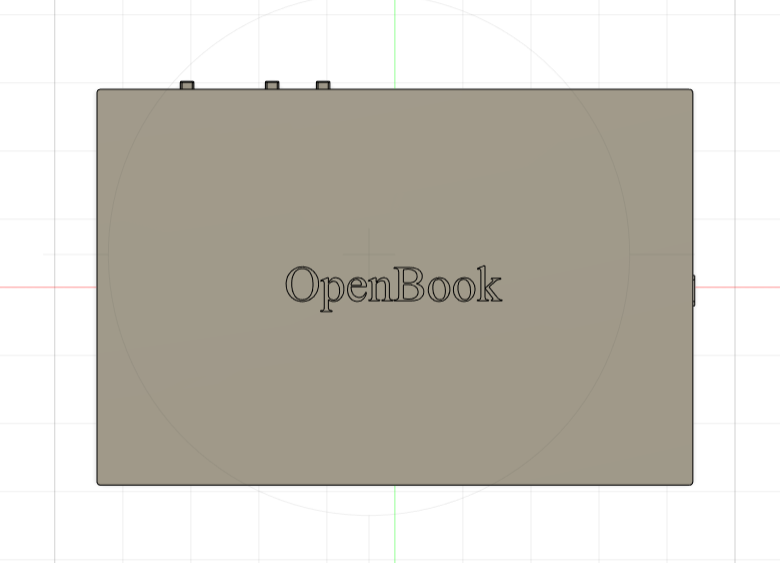
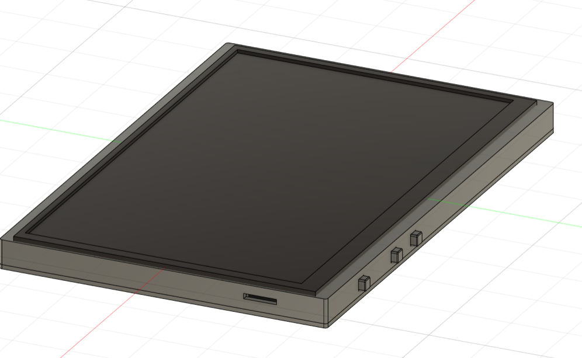
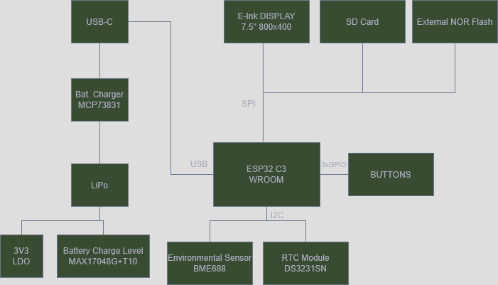
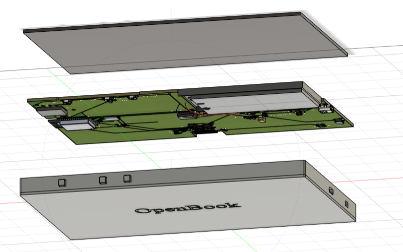
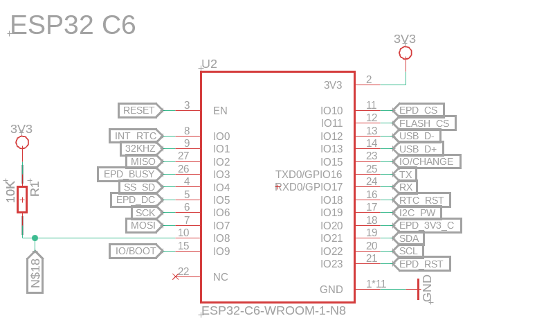

# openbook

## Overview

# 📚 eBook Reader – System Overview

This project is an eBook reader based on the ESP32-C3 microcontroller. It features a 7.5" E-Ink display, SD card storage, environmental sensing, and a rechargeable LiPo battery, all optimized for low power consumption and readability.

---

## 🧠 Core Component

### **ESP32-C3 WROOM**
The main microcontroller that handles:
- Display updates via **SPI**
- File system and memory management
- Button inputs through **GPIO**
- Communication with sensors and RTC via **I2C**
- USB communication for firmware updates or data transfer

---

## 📖 Display

### **E-Ink DISPLAY 7.5" 800x400**
- Ultra-low power display ideal for reading in bright light
- Interface: SPI
- Controlled by the ESP32 for rendering text and images

---

## 💾 Storage

- **SD Card**: Stores eBooks and data files
- **External NOR Flash**: Used for firmware, fonts, or static assets

---

## 🔋 Power Management

- **USB-C**: Input for charging and potential USB data connection
- **Battery Charger (MCP73831)**: Manages LiPo charging
- **LiPo Battery**: Powers the system when unplugged
- **Battery Level Monitor (MAX17048G+T10)**: Reports battery percentage to the ESP32
- **3V3 LDO Regulator**: Provides stable 3.3V for the system

---

## 🌡️ Environmental Sensing

### **BME688 Sensor**
- Measures:
  - Temperature
  - Humidity
  - Pressure
  - Air quality
- Data can be displayed or logged for contextual awareness

---

## 🕒 Real-Time Clock

### **DS3231SN RTC Module**
- Keeps track of time even when powered off
- Useful for:
  - Timestamps
  - Scheduled wake-ups
  - Time-based features

---

## ✅ Summary

This eBook reader offers:
- Crisp, low-power E-Ink display
- Offline storage via SD card and flash
- Rechargeable battery with power monitoring
- Real-time clock and environment sensing
- Simple, button-based navigation

---

> **Future Enhancements (Optional)**
> - Wi-Fi/Bluetooth syncing
> - Touch interface
> - OTA (Over-the-Air) updates

## Bill of Materials (BOM) 
|SAMACSYS_PARTS_USB4110GFA|Value                                                                         |Device                                                                        |Detailed Description                                                                                                                                                                                                                                                                                                                                                                                                                                                                                |Link                                                                                                                         |
|-------------------------|------------------------------------------------------------------------------|------------------------------------------------------------------------------|----------------------------------------------------------------------------------------------------------------------------------------------------------------------------------------------------------------------------------------------------------------------------------------------------------------------------------------------------------------------------------------------------------------------------------------------------------------------------------------------------|-----------------------------------------------------------------------------------------------------------------------------|
|BOOT_BUTTON              |BUTTON_CUSYOMV1                                                               |BUTTON_CUSYOMV1                                                               |                                                                                                                                                                                                                                                                                                                                                                                                                                                                                                    |https://industry.panasonic.com/global/en/products/control/switch/light-touch/number/evqpuj02k                                |
|C1                       |100nF                                                                         |ESP32_WROVER_EAGLE-LTSPICE_CC0402                                             |CAPACITOR, European symbol                                                                                                                                                                                                                                                                                                                                                                                                                                                                          |https://ro.mouser.com/ProductDetail/KYOCERA-AVX/12107C104KAT2A?qs=%252BdQmOuGyFcEpzvTfYF11Tg%3D%3D                           |
|C1_BAT                   |4.7uF                                                                         |ESP32_WROVER_EAGLE-LTSPICE_CC0402                                             |CAPACITOR, European symbol                                                                                                                                                                                                                                                                                                                                                                                                                                                                          |https://ro.mouser.com/ProductDetail/KYOCERA-AVX/12107C104KAT2A?qs=%252BdQmOuGyFcEpzvTfYF11Tg%3D%3D                           |
|C1_BAT1                  |4.7uF                                                                         |ESP32_WROVER_EAGLE-LTSPICE_CC0402                                             |CAPACITOR, European symbol                                                                                                                                                                                                                                                                                                                                                                                                                                                                          |https://ro.mouser.com/ProductDetail/KYOCERA-AVX/12107C104KAT2A?qs=%252BdQmOuGyFcEpzvTfYF11Tg%3D%3D                           |
|C1_BAT2                  |4.7uF                                                                         |EAGLE-LTSPICE_CC0402                                                          |CAPACITOR, European symbol                                                                                                                                                                                                                                                                                                                                                                                                                                                                          |https://ro.mouser.com/ProductDetail/KYOCERA-AVX/12107C104KAT2A?qs=%252BdQmOuGyFcEpzvTfYF11Tg%3D%3D                           |
|C2                       |100nF                                                                         |ESP32_WROVER_EAGLE-LTSPICE_CC0402                                             |CAPACITOR, European symbol                                                                                                                                                                                                                                                                                                                                                                                                                                                                          |https://ro.mouser.com/ProductDetail/KYOCERA-AVX/12107C104KAT2A?qs=%252BdQmOuGyFcEpzvTfYF11Tg%3D%3D                           |
|C2_BAT                   |4.7uF                                                                         |ESP32_WROVER_EAGLE-LTSPICE_CC0402                                             |CAPACITOR, European symbol                                                                                                                                                                                                                                                                                                                                                                                                                                                                          |https://ro.mouser.com/ProductDetail/KYOCERA-AVX/12107C104KAT2A?qs=%252BdQmOuGyFcEpzvTfYF11Tg%3D%3D                           |
|C3                       |100uF TANT                                                                    |RCL_CPOL-EUCT3528                                                             |POLARIZED CAPACITOR, European symbol                                                                                                                                                                                                                                                                                                                                                                                                                                                                |https://ro.mouser.com/ProductDetail/Panasonic/EEU-FS1K101L?qs=sGAEpiMZZMvwFf0viD3Y3fHxNcSaiftwbgqrEa58hlq7Mz20qWHEdw%3D%3D   |
|C4                       |4.7uF/25V                                                                     |ESP32_WROVER_EAGLE-LTSPICE_CC0402                                             |CAPACITOR, European symbol                                                                                                                                                                                                                                                                                                                                                                                                                                                                          |https://ro.mouser.com/ProductDetail/KYOCERA-AVX/12107C104KAT2A?qs=%252BdQmOuGyFcEpzvTfYF11Tg%3D%3D                           |
|C4_USB                   |100nF                                                                         |ESP32_WROVER_EAGLE-LTSPICE_CC0402                                             |CAPACITOR, European symbol                                                                                                                                                                                                                                                                                                                                                                                                                                                                          |https://ro.mouser.com/ProductDetail/KYOCERA-AVX/12107C104KAT2A?qs=%252BdQmOuGyFcEpzvTfYF11Tg%3D%3D                           |
|C5                       |1uF                                                                           |ESP32_WROVER_EAGLE-LTSPICE_CC0402                                             |CAPACITOR, European symbol                                                                                                                                                                                                                                                                                                                                                                                                                                                                          |https://ro.mouser.com/ProductDetail/KYOCERA-AVX/12107C104KAT2A?qs=%252BdQmOuGyFcEpzvTfYF11Tg%3D%3D                           |
|C5_USB                   |4.7uF                                                                         |ESP32_WROVER_EAGLE-LTSPICE_CC0402                                             |CAPACITOR, European symbol                                                                                                                                                                                                                                                                                                                                                                                                                                                                          |https://ro.mouser.com/ProductDetail/KYOCERA-AVX/12107C104KAT2A?qs=%252BdQmOuGyFcEpzvTfYF11Tg%3D%3D                           |
|C6                       |100nF                                                                         |ESP32_WROVER_EAGLE-LTSPICE_CC0402                                             |CAPACITOR, European symbol                                                                                                                                                                                                                                                                                                                                                                                                                                                                          |https://ro.mouser.com/ProductDetail/KYOCERA-AVX/12107C104KAT2A?qs=%252BdQmOuGyFcEpzvTfYF11Tg%3D%3D                           |
|C7                       |10uF                                                                          |ESP32_WROVER_EAGLE-LTSPICE_CC0402                                             |CAPACITOR, European symbol                                                                                                                                                                                                                                                                                                                                                                                                                                                                          |https://ro.mouser.com/ProductDetail/KYOCERA-AVX/12107C104KAT2A?qs=%252BdQmOuGyFcEpzvTfYF11Tg%3D%3D                           |
|C8                       |100nF                                                                         |ESP32_WROVER_EAGLE-LTSPICE_CC0402                                             |CAPACITOR, European symbol                                                                                                                                                                                                                                                                                                                                                                                                                                                                          |https://ro.mouser.com/ProductDetail/KYOCERA-AVX/12107C104KAT2A?qs=%252BdQmOuGyFcEpzvTfYF11Tg%3D%3D                           |
|C9                       |100nF                                                                         |EAGLE-LTSPICE_CC0402                                                          |CAPACITOR, European symbol                                                                                                                                                                                                                                                                                                                                                                                                                                                                          |https://ro.mouser.com/ProductDetail/KYOCERA-AVX/12107C104KAT2A?qs=%252BdQmOuGyFcEpzvTfYF11Tg%3D%3D                           |
|C10                      |100nF                                                                         |ESP32_WROVER_EAGLE-LTSPICE_CC0402                                             |CAPACITOR, European symbol                                                                                                                                                                                                                                                                                                                                                                                                                                                                          |https://ro.mouser.com/ProductDetail/KYOCERA-AVX/12107C104KAT2A?qs=%252BdQmOuGyFcEpzvTfYF11Tg%3D%3D                           |
|C10_SUPERCAP             |CPH3225A                                                                      |CPH3225A                                                                      |Cap 0.011F 3.3V 1210 Flat                                                                                                                                                                                                                                                                                                                                                                                                                                                                           |https://ro.mouser.com/ProductDetail/Seiko-Semiconductors/CPH3225A?qs=3etwrb1wR%252BhUOph6lAO7eg%3D%3D                        |
|CHANGE_BUTTON            |BUTTON_CUSYOMV1                                                               |BUTTON_CUSYOMV1                                                               |                                                                                                                                                                                                                                                                                                                                                                                                                                                                                                    |https://industry.panasonic.com/global/en/products/control/switch/light-touch/number/evqpuj02k                                |
|CHG_LED                  |                                                                              |ADAFRUIT_LEDCHIP-LED0603                                                      |LED                                                                                                                                                                                                                                                                                                                                                                                                                                                                                                 |https://ro.mouser.com/ProductDetail/BJB/35.116.1007-001-01?qs=iLKYxzqNS76jqQb6thkyzg%3D%3D                                   |
|C_DELAY                  |100nF                                                                         |ESP32_WROVER_EAGLE-LTSPICE_CC0402                                             |CAPACITOR, European symbol                                                                                                                                                                                                                                                                                                                                                                                                                                                                          |https://ro.mouser.com/ProductDetail/KYOCERA-AVX/12107C104KAT2A?qs=%252BdQmOuGyFcEpzvTfYF11Tg%3D%3D                           |
|D1                       |USBLC6-2SC6Y                                                                  |USBLC6-2SC6Y                                                                  |Low Cap. ESD Protection Auto SOT-23-6 STMicroelectronics USBLC6-2SC6Y, Dual Uni-Directional TVS Diode Array, 6-Pin SOT-23                                                                                                                                                                                                                                                                                                                                                                           |https://ro.mouser.com/ProductDetail/Nexperia/PMEG6030AEXEX?qs=olJun0bQHM8zqhEtOgE2ZA%3D%3D                                   |
|D2                       |ESP32_WROVER_AVX---SD0805S020S1R0_AVX_SD0805S020S1R0_0_0AVX_SD0805S020S1R0_0_0|ESP32_WROVER_AVX---SD0805S020S1R0_AVX_SD0805S020S1R0_0_0AVX_SD0805S020S1R0_0_0|Schottky Barrier Rectifier Diode                                                                                                                                                                                                                                                                                                                                                                                                                                                                    |https://ro.mouser.com/ProductDetail/Nexperia/PMEG6030AEXEX?qs=olJun0bQHM8zqhEtOgE2ZA%3D%3D                                   |
|D3                       |MBR0530                                                                       |MBR0530                                                                       |ON SEMICONDUCTOR - MBR0530 - DIODE, SCHOTTKY, 0.5A, 30V, SOD-123                                                                                                                                                                                                                                                                                                                                                                                                                                    |https://ro.mouser.com/ProductDetail/Nexperia/PMEG6030AEXEX?qs=olJun0bQHM8zqhEtOgE2ZA%3D%3D                                   |
|D4                       |MBR0530                                                                       |MBR0530                                                                       |ON SEMICONDUCTOR - MBR0530 - DIODE, SCHOTTKY, 0.5A, 30V, SOD-123                                                                                                                                                                                                                                                                                                                                                                                                                                    |https://ro.mouser.com/ProductDetail/Nexperia/PMEG6030AEXEX?qs=olJun0bQHM8zqhEtOgE2ZA%3D%3D                                   |
|D5                       |MBR0530                                                                       |MBR0530                                                                       |ON SEMICONDUCTOR - MBR0530 - DIODE, SCHOTTKY, 0.5A, 30V, SOD-123                                                                                                                                                                                                                                                                                                                                                                                                                                    |https://ro.mouser.com/ProductDetail/Nexperia/PMEG6030AEXEX?qs=olJun0bQHM8zqhEtOgE2ZA%3D%3D                                   |
|D6                       |PGB1010603MR                                                                  |PGB1010603MR                                                                  |Check availability                                                                                                                                                                                                                                                                                                                                                                                                                                                                                  |https://ro.mouser.com/ProductDetail/Nexperia/PMEG6030AEXEX?qs=olJun0bQHM8zqhEtOgE2ZA%3D%3D                                   |
|D7                       |ESP32_WROVER_AVX---SD0805S020S1R0_AVX_SD0805S020S1R0_0_0AVX_SD0805S020S1R0_0_0|ESP32_WROVER_AVX---SD0805S020S1R0_AVX_SD0805S020S1R0_0_0AVX_SD0805S020S1R0_0_0|Schottky Barrier Rectifier Diode                                                                                                                                                                                                                                                                                                                                                                                                                                                                    |https://ro.mouser.com/ProductDetail/Nexperia/PMEG6030AEXEX?qs=olJun0bQHM8zqhEtOgE2ZA%3D%3D                                   |
|D8                       |PGB1010603MR                                                                  |PGB1010603MR                                                                  |Schottky Barrier Rectifier Diode                                                                                                                                                                                                                                                                                                                                                                                                                                                                    |https://ro.mouser.com/ProductDetail/Nexperia/PMEG6030AEXEX?qs=olJun0bQHM8zqhEtOgE2ZA%3D%3D                                   |
|D9                       |PGB1010603MR                                                                  |PGB1010603MR                                                                  |Schottky Barrier Rectifier Diode                                                                                                                                                                                                                                                                                                                                                                                                                                                                    |https://ro.mouser.com/ProductDetail/Nexperia/PMEG6030AEXEX?qs=olJun0bQHM8zqhEtOgE2ZA%3D%3D                                   |
|D10                      |PGB1010603MR                                                                  |PGB1010603MR                                                                  |Schottky Barrier Rectifier Diode                                                                                                                                                                                                                                                                                                                                                                                                                                                                    |https://ro.mouser.com/ProductDetail/Nexperia/PMEG6030AEXEX?qs=olJun0bQHM8zqhEtOgE2ZA%3D%3D                                   |
|D11                      |PGB1010603MR                                                                  |PGB1010603MR                                                                  |Schottky Barrier Rectifier Diode                                                                                                                                                                                                                                                                                                                                                                                                                                                                    |https://ro.mouser.com/ProductDetail/Nexperia/PMEG6030AEXEX?qs=olJun0bQHM8zqhEtOgE2ZA%3D%3D                                   |
|D12                      |PGB1010603MR                                                                  |PGB1010603MR                                                                  |Schottky Barrier Rectifier Diode                                                                                                                                                                                                                                                                                                                                                                                                                                                                    |https://ro.mouser.com/ProductDetail/Nexperia/PMEG6030AEXEX?qs=olJun0bQHM8zqhEtOgE2ZA%3D%3D                                   |
|EPD_C1                   |1uF/50V                                                                       |ESP32_WROVER_EAGLE-LTSPICE_CC0402                                             |CAPACITOR, European symbol                                                                                                                                                                                                                                                                                                                                                                                                                                                                          |https://ro.mouser.com/ProductDetail/KEMET/MMK10105K50A01L4BULK?qs=IKDMbYZLynBqWdM%252BAUSFtw%3D%3D                           |
|EPD_C2                   |1uF/50V                                                                       |ESP32_WROVER_EAGLE-LTSPICE_CC0402                                             |CAPACITOR, European symbol                                                                                                                                                                                                                                                                                                                                                                                                                                                                          |https://ro.mouser.com/ProductDetail/KEMET/MMK10105K50A01L4BULK?qs=IKDMbYZLynBqWdM%252BAUSFtw%3D%3D                           |
|EPD_C5                   |1uF/50V                                                                       |ESP32_WROVER_EAGLE-LTSPICE_CC0402                                             |CAPACITOR, European symbol                                                                                                                                                                                                                                                                                                                                                                                                                                                                          |https://ro.mouser.com/ProductDetail/KEMET/MMK10105K50A01L4BULK?qs=IKDMbYZLynBqWdM%252BAUSFtw%3D%3D                           |
|EPD_C6                   |1uF/50V                                                                       |ESP32_WROVER_EAGLE-LTSPICE_CC0402                                             |CAPACITOR, European symbol                                                                                                                                                                                                                                                                                                                                                                                                                                                                          |https://ro.mouser.com/ProductDetail/KEMET/MMK10105K50A01L4BULK?qs=IKDMbYZLynBqWdM%252BAUSFtw%3D%3D                           |
|EPD_C7                   |1uF/50V                                                                       |ESP32_WROVER_EAGLE-LTSPICE_CC0402                                             |CAPACITOR, European symbol                                                                                                                                                                                                                                                                                                                                                                                                                                                                          |https://ro.mouser.com/ProductDetail/KEMET/MMK10105K50A01L4BULK?qs=IKDMbYZLynBqWdM%252BAUSFtw%3D%3D                           |
|EPD_C8                   |1uF/50V                                                                       |ESP32_WROVER_EAGLE-LTSPICE_CC0402                                             |CAPACITOR, European symbol                                                                                                                                                                                                                                                                                                                                                                                                                                                                          |https://ro.mouser.com/ProductDetail/KEMET/MMK10105K50A01L4BULK?qs=IKDMbYZLynBqWdM%252BAUSFtw%3D%3D                           |
|EPD_C9                   |1uF/50V                                                                       |ESP32_WROVER_EAGLE-LTSPICE_CC0402                                             |CAPACITOR, European symbol                                                                                                                                                                                                                                                                                                                                                                                                                                                                          |https://ro.mouser.com/ProductDetail/KEMET/MMK10105K50A01L4BULK?qs=IKDMbYZLynBqWdM%252BAUSFtw%3D%3D                           |
|EPD_C10                  |1uF/50V                                                                       |ESP32_WROVER_EAGLE-LTSPICE_CC0402                                             |CAPACITOR, European symbol                                                                                                                                                                                                                                                                                                                                                                                                                                                                          |https://ro.mouser.com/ProductDetail/KEMET/MMK10105K50A01L4BULK?qs=IKDMbYZLynBqWdM%252BAUSFtw%3D%3D                           |
|EPD_C11                  |1uF/50V                                                                       |ESP32_WROVER_EAGLE-LTSPICE_CC0402                                             |CAPACITOR, European symbol                                                                                                                                                                                                                                                                                                                                                                                                                                                                          |https://ro.mouser.com/ProductDetail/KEMET/MMK10105K50A01L4BULK?qs=IKDMbYZLynBqWdM%252BAUSFtw%3D%3D                           |
|EPD_C12                  |1uF/50V                                                                       |ESP32_WROVER_EAGLE-LTSPICE_CC0402                                             |CAPACITOR, European symbol                                                                                                                                                                                                                                                                                                                                                                                                                                                                          |https://ro.mouser.com/ProductDetail/KEMET/MMK10105K50A01L4BULK?qs=IKDMbYZLynBqWdM%252BAUSFtw%3D%3D                           |
|IC1                      |BD5229G-TR                                                                    |BD5229G-TR                                                                    |Voltage Detector with Adjustable Delay Time: CMOS processes are utilized to develop high precision, low current consumption CMOS reset ICs that allow arbitrary setting of the delay time. The extensive lineup includes both Nch Open Drain and CMOS output types in a wide range of detection voltages (from 2.3V to 6.0V, in 0.1V steps), enabling selection of the ideal solution based on customer requirements. In addition, the entire series is of course both lead-free and RoHS-compliant.|https://ro.mouser.com/ProductDetail/ROHM-Semiconductor/BD5229G-TR?qs=4kLU8WoGk0vvnhrrYwdszw%3D%3D                            |
|IC4                      |XC6220A331MR-G                                                                |XC6220A331MR-G                                                                |LDO Voltage Regulators                                                                                                                                                                                                                                                                                                                                                                                                                                                                              |                                                                                                                             |
|J1                       |FH34SRJ-24S-0.5SH_99_                                                         |FH34SRJ-24S-0.5SH_99_                                                         |24 Position FFC, FPC Connector Contacts, Top and Bottom 0.020 (0.50mm) Surface Mount, Right Angle"                                                                                                                                                                                                                                                                                                                                                                                                  |                                                                                                                             |
|J2                       |SAMACSYS_PARTS_USB4110-GF-A                                                   |SAMACSYS_PARTS_USB4110-GF-A                                                   |CONN USB 2.0 TYPE-C R/A SMT                                                                                                                                                                                                                                                                                                                                                                                                                                                                         |                                                                                                                             |
|J3                       |QWIIC_RIGHT_ANGLE                                                             |QWIIC_CONNECTORJS-1MM                                                         |SparkFun I2C Standard Qwiic Connector                                                                                                                                                                                                                                                                                                                                                                                                                                                               |                                                                                                                             |
|J4                       |112A-TAAR-R03_ATTEND                                                          |112A-TAAR-R03_ATTEND                                                          |Micro SD Card Socket, Push-Push Type, Top Mount, SMT, H=1.83mm, 10u                                                                                                                                                                                                                                                                                                                                                                                                                                 |                                                                                                                             |
|L1                       |68uH                                                                          |744043680IND_4828-WE-TPC_WRE                                                  |                                                                                                                                                                                                                                                                                                                                                                                                                                                                                                    |                                                                                                                             |
|PFMF.050.1               |ESP32C6_VARISTORCN1812                                                        |ESP32C6_VARISTORCN1812                                                        |VARISTOR                                                                                                                                                                                                                                                                                                                                                                                                                                                                                            |                                                                                                                             |
|Q1                       |20V/4.2A/52mO/1.4W                                                            |ESP32_WROVER_SPARKFUN-DISCRETESEMI_MOSFET_PCH-DMG2305UX-7                     |P-channel MOSFETs                                                                                                                                                                                                                                                                                                                                                                                                                                                                                   |                                                                                                                             |
|Q2                       |20V/4.2A/52mO/1.4W                                                            |ESP32_WROVER_SPARKFUN-DISCRETESEMI_MOSFET_PCH-DMG2305UX-7                     |P-channel MOSFETs                                                                                                                                                                                                                                                                                                                                                                                                                                                                                   |https://ro.mouser.com/ProductDetail/Vishay-Siliconix/SQ3425CEV-T1_GE3?qs=i8QVZAFTkqQazbKSzWc2Vg%3D%3D                        |
|Q3                       |SI1308EDL-T1-GE3                                                              |SI1308EDL-T1-GE3                                                              |MOSFET N-Ch 30V 1.5A TrenchFET SC70 Vishay Si1308EDL-T1-GE3 N-channel MOSFET Transistor, 1.5 A, 30 V, 3-Pin SC-70                                                                                                                                                                                                                                                                                                                                                                                   |https://ro.mouser.com/ProductDetail/Vishay-Semiconductors/SI1308EDL-T1-GE3?qs=bX1%252BNvsK%2FBramh9tgpOaEw%3D%3D             |
|R1                       |10K                                                                           |ESP32_WROVER_EAGLE-LTSPICE_RR0402                                             |RESISTOR, European symbol                                                                                                                                                                                                                                                                                                                                                                                                                                                                           |https://ro.mouser.com/ProductDetail/Vishay-Beyschlag/MCS0402MD4703BE500?qs=sGAEpiMZZMtlubZbdhIBIE4nSA98ICq40rObWhdYP%252BY%3D|
|R1-PINH                  |10K                                                                           |ESP32_WROVER_EAGLE-LTSPICE_RR0402                                             |RESISTOR, European symbol                                                                                                                                                                                                                                                                                                                                                                                                                                                                           |https://ro.mouser.com/ProductDetail/Vishay-Beyschlag/MCS0402MD4703BE500?qs=sGAEpiMZZMtlubZbdhIBIE4nSA98ICq40rObWhdYP%252BY%3D|
|R1-PINH1                 |10K                                                                           |ESP32_WROVER_EAGLE-LTSPICE_RR0402                                             |RESISTOR, European symbol                                                                                                                                                                                                                                                                                                                                                                                                                                                                           |https://ro.mouser.com/ProductDetail/Vishay-Beyschlag/MCS0402MD4703BE500?qs=sGAEpiMZZMtlubZbdhIBIE4nSA98ICq40rObWhdYP%252BY%3D|
|R1_BAT                   |200                                                                           |ESP32_WROVER_EAGLE-LTSPICE_RR0402                                             |RESISTOR, European symbol                                                                                                                                                                                                                                                                                                                                                                                                                                                                           |https://ro.mouser.com/ProductDetail/Vishay-Beyschlag/MCS0402MD4703BE500?qs=sGAEpiMZZMtlubZbdhIBIE4nSA98ICq40rObWhdYP%252BY%3D|
|R1_PWRUSB                |100K                                                                          |ESP32_WROVER_EAGLE-LTSPICE_RR0402                                             |RESISTOR, European symbol                                                                                                                                                                                                                                                                                                                                                                                                                                                                           |https://ro.mouser.com/ProductDetail/Vishay-Beyschlag/MCS0402MD4703BE500?qs=sGAEpiMZZMtlubZbdhIBIE4nSA98ICq40rObWhdYP%252BY%3D|
|R2                       |2.2                                                                           |ESP32_WROVER_EAGLE-LTSPICE_RR0402                                             |RESISTOR, European symbol                                                                                                                                                                                                                                                                                                                                                                                                                                                                           |https://ro.mouser.com/ProductDetail/Vishay-Beyschlag/MCS0402MD4703BE500?qs=sGAEpiMZZMtlubZbdhIBIE4nSA98ICq40rObWhdYP%252BY%3D|
|R2-PINH                  |10K                                                                           |ESP32_WROVER_EAGLE-LTSPICE_RR0402                                             |RESISTOR, European symbol                                                                                                                                                                                                                                                                                                                                                                                                                                                                           |https://ro.mouser.com/ProductDetail/Vishay-Beyschlag/MCS0402MD4703BE500?qs=sGAEpiMZZMtlubZbdhIBIE4nSA98ICq40rObWhdYP%252BY%3D|
|R2-PINH1                 |10K                                                                           |ESP32_WROVER_EAGLE-LTSPICE_RR0402                                             |RESISTOR, European symbol                                                                                                                                                                                                                                                                                                                                                                                                                                                                           |https://ro.mouser.com/ProductDetail/Vishay-Beyschlag/MCS0402MD4703BE500?qs=sGAEpiMZZMtlubZbdhIBIE4nSA98ICq40rObWhdYP%252BY%3D|
|R2-USB                   |5k1                                                                           |ESP32_WROVER_EAGLE-LTSPICE_RR0402                                             |RESISTOR, European symbol                                                                                                                                                                                                                                                                                                                                                                                                                                                                           |https://ro.mouser.com/ProductDetail/Vishay-Beyschlag/MCS0402MD4703BE500?qs=sGAEpiMZZMtlubZbdhIBIE4nSA98ICq40rObWhdYP%252BY%3D|
|R2-USB1                  |5k1                                                                           |ESP32_WROVER_EAGLE-LTSPICE_RR0402                                             |RESISTOR, European symbol                                                                                                                                                                                                                                                                                                                                                                                                                                                                           |https://ro.mouser.com/ProductDetail/Vishay-Beyschlag/MCS0402MD4703BE500?qs=sGAEpiMZZMtlubZbdhIBIE4nSA98ICq40rObWhdYP%252BY%3D|
|R2_BAT                   |2K                                                                            |ESP32_WROVER_EAGLE-LTSPICE_RR0402                                             |RESISTOR, European symbol                                                                                                                                                                                                                                                                                                                                                                                                                                                                           |https://ro.mouser.com/ProductDetail/Vishay-Beyschlag/MCS0402MD4703BE500?qs=sGAEpiMZZMtlubZbdhIBIE4nSA98ICq40rObWhdYP%252BY%3D|
|R3                       |10K                                                                           |ESP32_WROVER_EAGLE-LTSPICE_RR0402                                             |RESISTOR, European symbol                                                                                                                                                                                                                                                                                                                                                                                                                                                                           |https://ro.mouser.com/ProductDetail/Vishay-Beyschlag/MCS0402MD4703BE500?qs=sGAEpiMZZMtlubZbdhIBIE4nSA98ICq40rObWhdYP%252BY%3D|
|R4                       |10K                                                                           |ESP32_WROVER_EAGLE-LTSPICE_RR0402                                             |RESISTOR, European symbol                                                                                                                                                                                                                                                                                                                                                                                                                                                                           |https://ro.mouser.com/ProductDetail/Vishay-Beyschlag/MCS0402MD4703BE500?qs=sGAEpiMZZMtlubZbdhIBIE4nSA98ICq40rObWhdYP%252BY%3D|
|R5                       |10K                                                                           |ESP32_WROVER_EAGLE-LTSPICE_RR0402                                             |RESISTOR, European symbol                                                                                                                                                                                                                                                                                                                                                                                                                                                                           |https://ro.mouser.com/ProductDetail/Vishay-Beyschlag/MCS0402MD4703BE500?qs=sGAEpiMZZMtlubZbdhIBIE4nSA98ICq40rObWhdYP%252BY%3D|
|R6                       |10K                                                                           |ESP32_WROVER_EAGLE-LTSPICE_RR0402                                             |RESISTOR, European symbol                                                                                                                                                                                                                                                                                                                                                                                                                                                                           |https://ro.mouser.com/ProductDetail/Vishay-Beyschlag/MCS0402MD4703BE500?qs=sGAEpiMZZMtlubZbdhIBIE4nSA98ICq40rObWhdYP%252BY%3D|
|R7                       |10K                                                                           |ESP32_WROVER_EAGLE-LTSPICE_RR0402                                             |RESISTOR, European symbol                                                                                                                                                                                                                                                                                                                                                                                                                                                                           |https://ro.mouser.com/ProductDetail/Vishay-Beyschlag/MCS0402MD4703BE500?qs=sGAEpiMZZMtlubZbdhIBIE4nSA98ICq40rObWhdYP%252BY%3D|
|R8                       |10K                                                                           |ESP32_WROVER_EAGLE-LTSPICE_RR0402                                             |RESISTOR, European symbol                                                                                                                                                                                                                                                                                                                                                                                                                                                                           |https://ro.mouser.com/ProductDetail/Vishay-Beyschlag/MCS0402MD4703BE500?qs=sGAEpiMZZMtlubZbdhIBIE4nSA98ICq40rObWhdYP%252BY%3D|
|R9                       |10K                                                                           |ESP32_WROVER_EAGLE-LTSPICE_RR0402                                             |RESISTOR, European symbol                                                                                                                                                                                                                                                                                                                                                                                                                                                                           |https://ro.mouser.com/ProductDetail/Vishay-Beyschlag/MCS0402MD4703BE500?qs=sGAEpiMZZMtlubZbdhIBIE4nSA98ICq40rObWhdYP%252BY%3D|
|R10                      |10K                                                                           |ESP32_WROVER_EAGLE-LTSPICE_RR0402                                             |RESISTOR, European symbol                                                                                                                                                                                                                                                                                                                                                                                                                                                                           |https://ro.mouser.com/ProductDetail/Vishay-Beyschlag/MCS0402MD4703BE500?qs=sGAEpiMZZMtlubZbdhIBIE4nSA98ICq40rObWhdYP%252BY%3D|
|RESET_BUTTON             |BUTTON_CUSYOMV1                                                               |BUTTON_CUSYOMV1                                                               |                                                                                                                                                                                                                                                                                                                                                                                                                                                                                                    |https://industry.panasonic.com/global/en/products/control/switch/light-touch/number/evqpuj02k                                |
|R_BOOT                   |10K                                                                           |ESP32_WROVER_EAGLE-LTSPICE_RR0402                                             |RESISTOR, European symbol                                                                                                                                                                                                                                                                                                                                                                                                                                                                           |https://ro.mouser.com/ProductDetail/Vishay-Beyschlag/MCS0402MD4703BE500?qs=sGAEpiMZZMtlubZbdhIBIE4nSA98ICq40rObWhdYP%252BY%3D|
|R_CAPACITOR              |15                                                                            |ESP32_WROVER_EAGLE-LTSPICE_RR0402                                             |RESISTOR, European symbol                                                                                                                                                                                                                                                                                                                                                                                                                                                                           |https://ro.mouser.com/ProductDetail/Vishay-Beyschlag/MCS0402MD4703BE500?qs=sGAEpiMZZMtlubZbdhIBIE4nSA98ICq40rObWhdYP%252BY%3D|
|R_CHANGE                 |10K                                                                           |ESP32_WROVER_EAGLE-LTSPICE_RR0402                                             |RESISTOR, European symbol                                                                                                                                                                                                                                                                                                                                                                                                                                                                           |https://ro.mouser.com/ProductDetail/Vishay-Beyschlag/MCS0402MD4703BE500?qs=sGAEpiMZZMtlubZbdhIBIE4nSA98ICq40rObWhdYP%252BY%3D|
|R_CL1                    |10K                                                                           |ESP32_WROVER_EAGLE-LTSPICE_RR0402                                             |RESISTOR, European symbol                                                                                                                                                                                                                                                                                                                                                                                                                                                                           |https://ro.mouser.com/ProductDetail/Vishay-Beyschlag/MCS0402MD4703BE500?qs=sGAEpiMZZMtlubZbdhIBIE4nSA98ICq40rObWhdYP%252BY%3D|
|R_RESET                  |10K                                                                           |ESP32_WROVER_EAGLE-LTSPICE_RR0402                                             |RESISTOR, European symbol                                                                                                                                                                                                                                                                                                                                                                                                                                                                           |https://ro.mouser.com/ProductDetail/Vishay-Beyschlag/MCS0402MD4703BE500?qs=sGAEpiMZZMtlubZbdhIBIE4nSA98ICq40rObWhdYP%252BY%3D|
|SENSOR2                  |                                                                              |ESP32_WROVER_BME680_BME680                                                    |Integrated Environmental Unit                                                                                                                                                                                                                                                                                                                                                                                                                                                                       |https://ro.mouser.com/ProductDetail/Bosch-Sensortec/BME680?qs=v271MhAjFHjo0yA%2FC4OnDQ%3D%3D                                 |
|SJ1                      |                                                                              |SJ                                                                            |SMD solder JUMPER                                                                                                                                                                                                                                                                                                                                                                                                                                                                                   |https://ro.mouser.com/ProductDetail/Nidec-Components/CJS-1201B?qs=XeJtXLiO41SSSa2Z7HG9Iw%3D%3D                               |
|TP1                      |TPTP20R                                                                       |TPTP20R                                                                       |Test pad                                                                                                                                                                                                                                                                                                                                                                                                                                                                                            |                                                                                                                             |
|TP2                      |TPTP20R                                                                       |TPTP20R                                                                       |Test pad                                                                                                                                                                                                                                                                                                                                                                                                                                                                                            |                                                                                                                             |
|TP3                      |TPTP20R                                                                       |TPTP20R                                                                       |Test pad                                                                                                                                                                                                                                                                                                                                                                                                                                                                                            |                                                                                                                             |
|TP4                      |TPTP20R                                                                       |TPTP20R                                                                       |Test pad                                                                                                                                                                                                                                                                                                                                                                                                                                                                                            |                                                                                                                             |
|TP5                      |TPTP20R                                                                       |TPTP20R                                                                       |Test pad                                                                                                                                                                                                                                                                                                                                                                                                                                                                                            |                                                                                                                             |
|TP6                      |TPTP20R                                                                       |TPTP20R                                                                       |Test pad                                                                                                                                                                                                                                                                                                                                                                                                                                                                                            |                                                                                                                             |
|TP7                      |TPTP20R                                                                       |TPTP20R                                                                       |Test pad                                                                                                                                                                                                                                                                                                                                                                                                                                                                                            |                                                                                                                             |
|TP8                      |TPTP20R                                                                       |TPTP20R                                                                       |Test pad                                                                                                                                                                                                                                                                                                                                                                                                                                                                                            |                                                                                                                             |
|TP9                      |TPTP20R                                                                       |TPTP20R                                                                       |Test pad                                                                                                                                                                                                                                                                                                                                                                                                                                                                                            |                                                                                                                             |
|TP10                     |TPTP20R                                                                       |TPTP20R                                                                       |Test pad                                                                                                                                                                                                                                                                                                                                                                                                                                                                                            |                                                                                                                             |
|TP11                     |TPTP20R                                                                       |TPTP20R                                                                       |Test pad                                                                                                                                                                                                                                                                                                                                                                                                                                                                                            |                                                                                                                             |
|TP12                     |TPTP20R                                                                       |TPTP20R                                                                       |Test pad                                                                                                                                                                                                                                                                                                                                                                                                                                                                                            |                                                                                                                             |
|TP13                     |TPTP20R                                                                       |TPTP20R                                                                       |Test pad                                                                                                                                                                                                                                                                                                                                                                                                                                                                                            |                                                                                                                             |
|TP14                     |TPTP20R                                                                       |TPTP20R                                                                       |Test pad                                                                                                                                                                                                                                                                                                                                                                                                                                                                                            |                                                                                                                             |
|TP15                     |TPTP20R                                                                       |TPTP20R                                                                       |Test pad                                                                                                                                                                                                                                                                                                                                                                                                                                                                                            |                                                                                                                             |
|TP16                     |TPTP20R                                                                       |TPTP20R                                                                       |Test pad                                                                                                                                                                                                                                                                                                                                                                                                                                                                                            |                                                                                                                             |
|TP17                     |TPTP20R                                                                       |TPTP20R                                                                       |Test pad                                                                                                                                                                                                                                                                                                                                                                                                                                                                                            |                                                                                                                             |
|U1                       |W25Q512JVEIQ                                                                  |W25Q512JVEIQ                                                                  |                                                                                                                                                                                                                                                                                                                                                                                                                                                                                                    |https://ro.mouser.com/ProductDetail/Winbond/W25Q512JVEIQ?qs=l7cgNqFNU1jw6svr3at6tA%3D%3D                                     |
|U2                       |ESP32-C6-WROOM-1-N8                                                           |ESP32-C6-WROOM-1-N8                                                           |                                                                                                                                                                                                                                                                                                                                                                                                                                                                                                    |https://ro.mouser.com/ProductDetail/Espressif-Systems/ESP32-C6-WROOM-1-N8?qs=8Wlm6%252BaMh8ST02Gmwp74cw%3D%3D                |
|U3                       |DS3231SN#                                                                     |DS3231SN#                                                                     |                                                                                                                                                                                                                                                                                                                                                                                                                                                                                                    |https://ro.mouser.com/ProductDetail/Analog-Devices-Maxim-Integrated/DS3231SN?qs=1eQvB6Dk1vhUlr8%2FOrV0Fw%3D%3D               |
|U4                       |MAX17048G+T10                                                                 |MAX17048G+T10                                                                 |                                                                                                                                                                                                                                                                                                                                                                                                                                                                                                    |https://ro.mouser.com/ProductDetail/Analog-Devices-Maxim-Integrated/MAX17048G%2bT10?qs=D7PJwyCwLAoGnnn8jEPRBQ%3D%3D          |
|U5                       |MCP73831                                                                      |ESP32_WROVER_SPARKFUN-IC-POWER_MCP73831                                       |MCP73831T Li-Ion, Li-Pol Controller                                                                                                                                                                                                                                                                                                                                                                                                                                                                 |https://ro.mouser.com/ProductDetail/Microchip-Technology/MCP73831T-2ACI-OT?qs=yUQqVecv4qvbBQBGbHx0Mw%3D%3D                   |

## Detailed description

- Resistor (R1) connected to GPIO8: This is a pull-up resistor connected to GPIO8. Pull-up resistors are used to ensure a pin has a defined high state when no external signal is applied.
- GPIO8: This is a general-purpose input/output pin. It can be configured as either an input or an output.
- IO/BOOT (Pin 15): This pin is used to put the ESP32-C6 into bootloader mode, which is necessary for flashing firmware.
- NC (Pin 22): This stands for "No Connection." This pin is not connected to anything in this particular circuit.
- EN (Pin 3): This is the Enable pin. Pulling this pin low resets the ESP32-C6.
- INT_RTC (Pin 8): This is likely an interrupt pin related to the Real-Time Clock (RTC) functionality.
- 32KHz (Pin 9): This is probably the input for a 32.768 kHz crystal oscillator, which is used for the RTC.
- MISO (Pin 27): This is the Master In Slave Out pin for the SPI (Serial Peripheral Interface) communication protocol.
- EPD_BUSY (Pin 4): This pin is likely used to signal the busy state of an E-Paper Display (EPD).
- SS_SD (Pin 5): This is the Slave Select pin for the SD card interface.
- EPD_DC (Pin 6): This is the Data/Command pin for the EPD.
- SCK (Pin 7): This is the Serial Clock pin for SPI communication.
- MOSI (Pin 10): This is the Master Out Slave In pin for SPI communication.
- 3V3 (Pin 2): This is another 3.3V power supply pin.
- IO10 to IO15 (Pins 11-14, 23): These are general-purpose input/output pins.
- TXD0/GPIO16 (Pin 24): This is the transmit pin for UART0 (Universal Asynchronous Receiver/Transmitter) and also functions as GPIO16.
- RXD0/GPIO17 (Pin 25): This is the receive pin for UART0 and also functions as GPIO17.
- RX (Pin 16): This is likely another receive pin, possibly for a second UART.
- RTC_RST (Pin 17): This is the reset pin for the RTC.
- I2C_PW (Pin 12): This pin might be related to powering the I2C (Inter-Integrated Circuit) bus.
- IO18 to IO23 (Pins 18-21): These are general-purpose input/output pins.
- EPD_3V3_C (Pin 19): This is likely a 3.3V power supply pin specifically for the EPD.
- SDA (Pin 20): This is the Serial Data pin for I2C communication.
- SCL (Pin 21): This is the Serial Clock pin for I2C communication.
- EPD_RST (Pin 21): This is the reset pin for the EPD.
- 1*11 (Pin 1): This indicates that pin 1 is connected to ground (GND).
